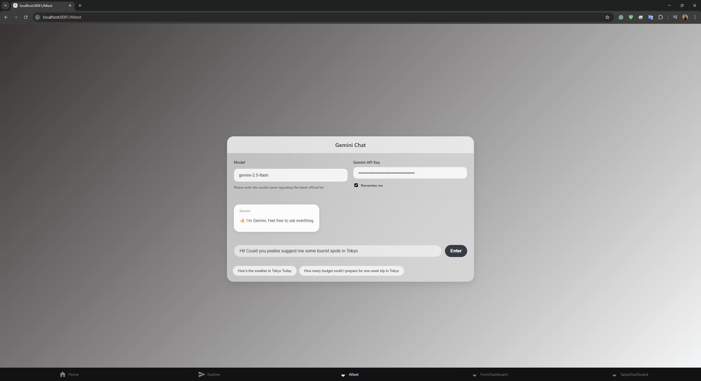
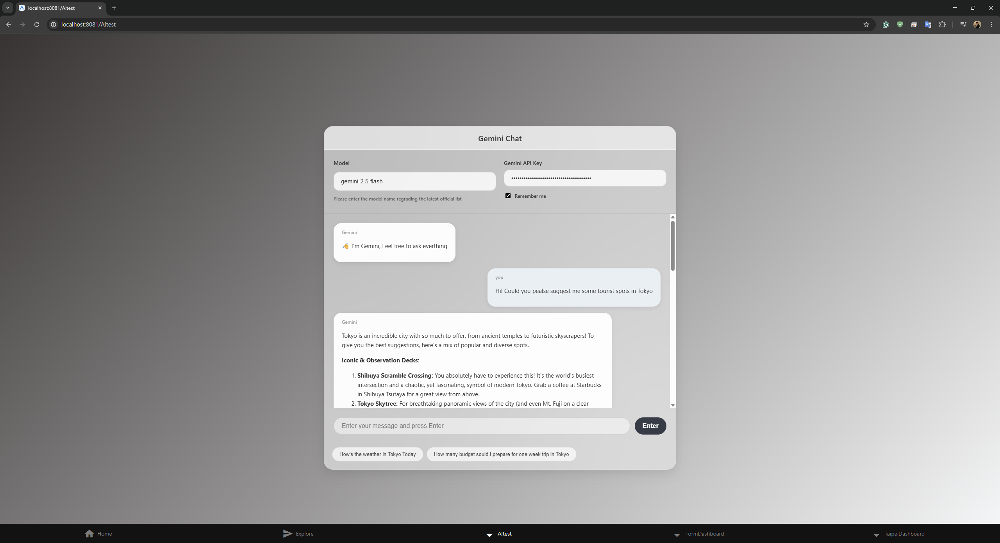
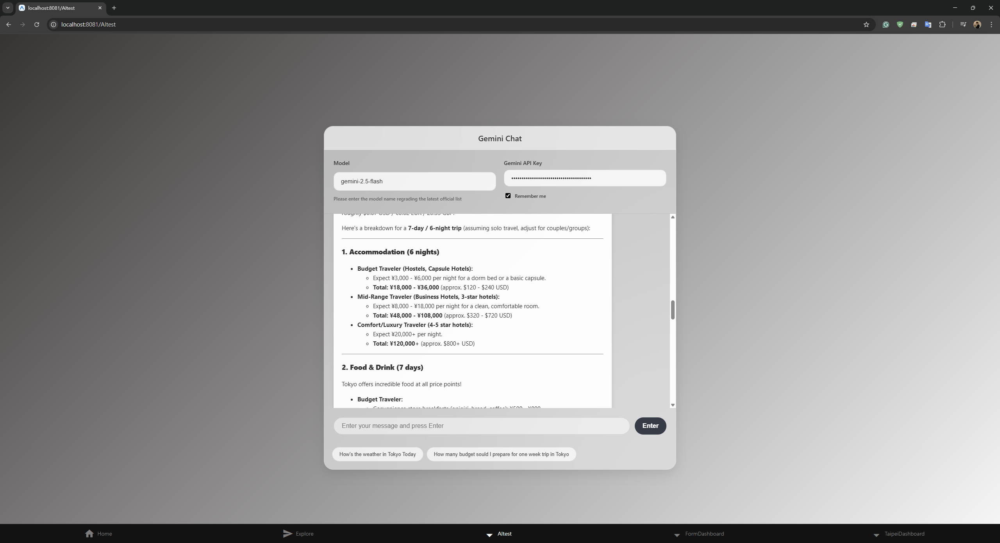

# 114_1 網際網路概論 (Introduction to the Internet)

> **課程名稱**：網際網路概論
> **學期**：114學年度第1學期
> **學生**：謝博全 (41371904H)

## 📂 作業列表 (Assignments)

### 🔹 HW1 : 個人網頁 (Personal Web Page)

* **網頁連結**：[Personal Web Page](https://lianin1.github.io/114_1-Introduction-to-the-Internet/)

---

### 🔹 HW2 : API 串接與應用

* **台北城市儀表板 API 呼叫展示**：[YouTube 影片](https://youtu.be/xSvVghIxz4U)

* **AI API 串接展示**：[YouTube 影片](https://youtu.be/Rl_JJV3mpOs)

🔻 點擊查看 HW2 修改與實作細節

在本次作業的 AI API 串接練習中，針對老師原有的程式碼，進行了以下三大主要修改：

1. **UI 美化**：將整體使用者介面進行視覺優化與調整。

2. **語言調整**：修改各項描述語句語言 (CN -> EN)。

3. **Markdown 支援**：使用 `ReactMarkdown` 套件，針對 API 回傳文字進行 Markdown 語法解析，呈現更佳的文字排版效果。

**成果截圖：**

> 修改新增部分皆在 `HW2/AItest.tsx` 進行標註說明，可透過關鍵字 **"HW2"** 搜尋。

---

### 🔹 HW3 : Git 版本控制實作

* **GitHub Page**：[Repository 連結](https://github.com/Lianin1/ITTI_HW3)

* **講解影片**：[YouTube 連結](https://youtu.be/bkrV4a2qT1M)

---

### 🔹 HW4 : 雲端部署實作 (Cloud Deployment)

* **雲端部署連結**：
  * [Render 部署網址](https://itti-hw3.onrender.com/)
  * [Zeabur 部署網址](https://1233.zeabur.app/)

* **部署平台**：Render, Zeabur

* **使用的 API**：
  * Google Maps API
  * 交通部中央氣象署一般天氣預報 (今明 36 小時天氣預報)
  * The Cat API

* **部署方式說明**：Render 與 Zeabur 皆設定為直連 GitHub Repository 進行自動化部署 (Auto Deployment)。

---

## 🚀 期末專題 (Final Project)

### **專題名稱：轉生修仙錄 (Reincarnation Cultivation Record)**

這是一個結合 **Generative AI** 的無限流文字冒險遊戲，透過 LLM 擔任「天道系統」，為玩家生成獨一無二的修仙人生。

| 項目 | 內容 | 
 | ----- | ----- | 
| **組員姓名與學號** | 謝博全 41371904H | 
| **線上網站網址** | <https://ntnu-itti-final.onrender.com> | 
| **YouTube 影片** | <https://youtu.be/7-F5Nm_g_8g> | 
| **GitHub Repo** | <https://github.com/Lianin1/NTNU_ITTI_Final> |
